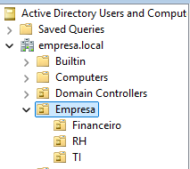
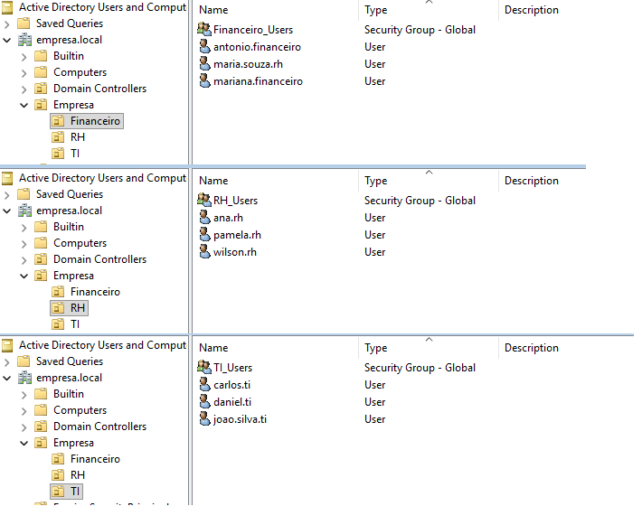
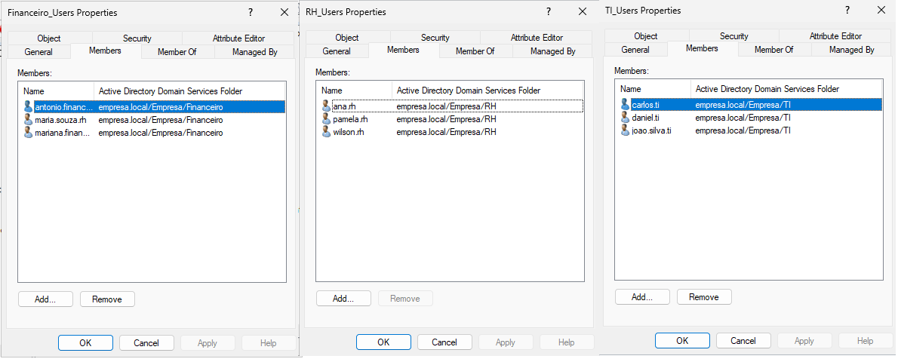
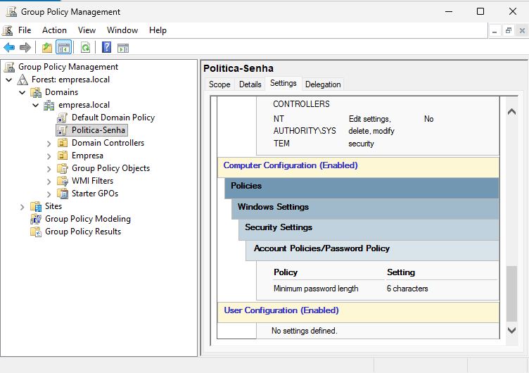

# 🖥️ Active Directory Lab

## 🎯 Objetivo
Simular um ambiente corporativo com Active Directory.

---

## 🧱 Estrutura

- Domínio: empresa.local
- OUs:
  - TI
  - RH
  - Financeiro

---

## 👥 Usuários

- antonio.financeiro
- maria.souza.financeiro
- mariana.financeiro
- ana.rh
- pamela.rh
- wilson.rh
- carlos.ti
- daniel.ti
- joao.silva.ti
---

## 🧩 Grupos

- TI_Users
- RH_Users
- Financeiro_Users

---

## 🔒 GPO

- Política de senha configurada

---

## 🚀 Projeto voltado para Suporte Técnico / Help Desk

---

## 📸 Evidências

### Estrutura

### Usuários

### Grupos

### GPO

